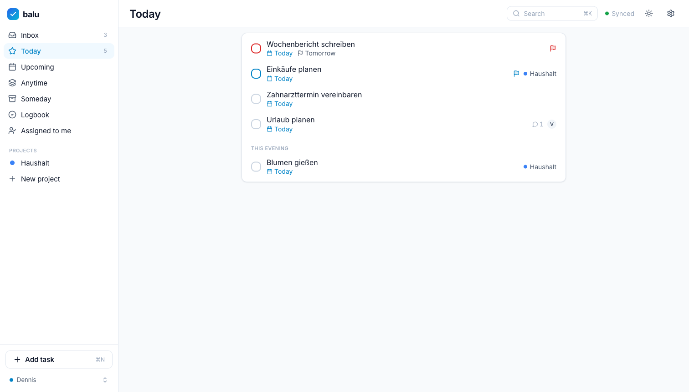
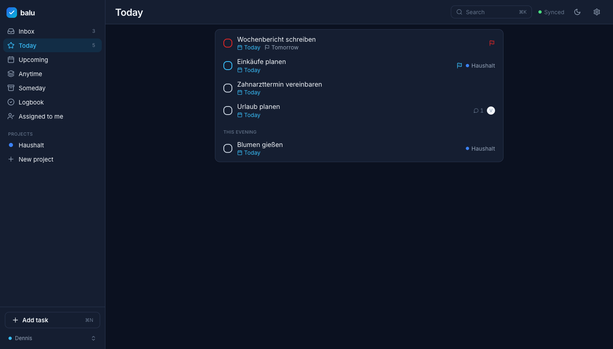

# Balu

A self-hostable, multi-tenant todo app with first-class iOS and Android apps.
**The self-hostable todo app that feels like Things and syncs like Todoist.**

- Offline-first everywhere: every client keeps a full local replica and a durable
  command queue — no spinners, airplane mode just works.
- Natural-language quick-add in German and English ("Wäsche waschen jeden zweiten
  Dienstag #Haushalt bis Freitag"), with live token highlighting.
- Start dates and deadlines are separate things, like they should be.
- Workspaces, roles (incl. read-only viewers), invite links, task assignment,
  per-task comments.
- Notifications where self-hosters live: **ntfy, email, Telegram** — reminders,
  assignments, and comments reach you without app-store push relays.

| Light | Dark |
|---|---|
|  |  |

## Run it

```sh
cp .env.example .env
printf 'BALU_SECRET_KEY=%s\nBALU_DB_PASSWORD=%s\n' "$(openssl rand -hex 32)" "$(openssl rand -hex 16)" >> .env
docker compose up --build
```

Open http://localhost:8080, register, done. One app container + Postgres — that's the
whole deployment. Configuration via env: `BALU_PORT`, `BALU_SECRET_KEY`,
`BALU_DB_PASSWORD`, `BALU_ALLOW_REGISTRATION`, `BALU_CORS_ORIGINS`.

`BALU_SECRET_KEY` and `BALU_DB_PASSWORD` have **no defaults** — compose refuses to
start without them, and the server refuses to boot on a weak (<32 char) or
placeholder signing key. For a throwaway local run you can set `BALU_DEV=1` to
bypass the key check.

### Production notes

- Set a real `BALU_SECRET_KEY` (e.g. `openssl rand -hex 32`) and `BALU_DB_PASSWORD`.
- CORS is same-origin by default. Only set `BALU_CORS_ORIGINS` if you serve the web
  client from a different origin than the API.
- Put a TLS-terminating reverse proxy (Caddy/Traefik/nginx) in front and set
  `BALU_ALLOW_REGISTRATION=false` after creating your accounts — invites still work.
- Notification transports are optional: `BALU_SMTP_HOST/PORT/USER/PASSWORD/FROM`
  enable email, `BALU_TELEGRAM_BOT_TOKEN` enables Telegram; ntfy needs nothing.
- Back up the `balu-db` volume; the app container is stateless.

## Repo layout

| Path | What |
|---|---|
| `server/` | FastAPI backend: REST auth + sync engine, serves the built web client |
| `apps/web/` | React web client (Vite + TS) |
| `apps/mobile/` | Expo/React Native app (iOS + Android) |
| `packages/` | shared TS: `@balu/domain`, `@balu/nl-parser` (de+en), `@balu/sync-client`, `@balu/api-client` |
| `docs/` | design language, API + sync contract, roadmap |

## Development

- Backend: `cd server && make dev` (needs the test/dev Postgres: `make db`)
- Web: `pnpm install && pnpm --filter @balu/web dev` (proxies `/api` → `:8000`)
- Mobile: `pnpm --filter @balu/mobile start` — see `apps/mobile/README.md`

## Docs

- [docs/api/CONTRACT.md](docs/api/CONTRACT.md) — API + sync-protocol contract (source of
  truth; start here to write your own client)
- [docs/DESIGN.md](docs/DESIGN.md) — design language: color system, typography, motion, IA
- [docs/ROADMAP.md](docs/ROADMAP.md) — what's next, and the explicit non-goals
- [CHANGELOG.md](CHANGELOG.md)

## License

[MIT](LICENSE)
